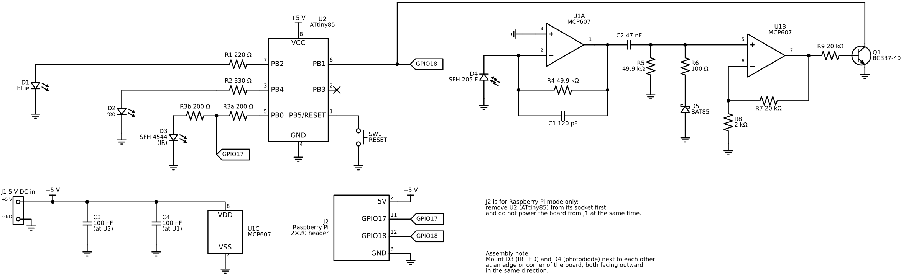
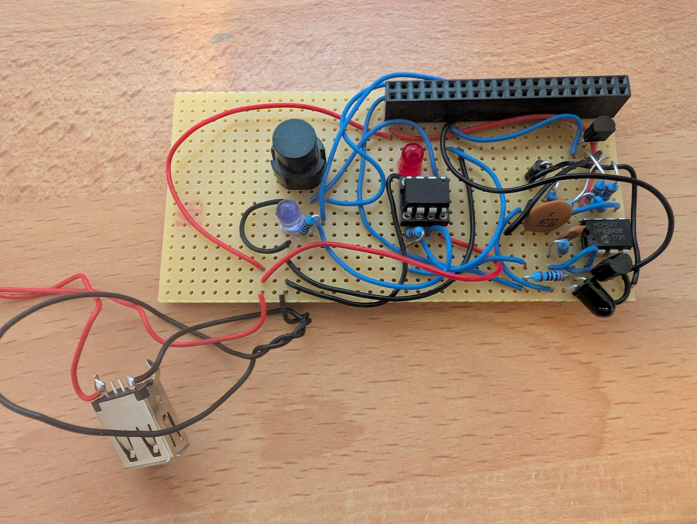

# 4. ATtiny85 board (hardware)

The standalone launcher is one small board: an ATtiny85, an IR LED to send, a
photodiode with a two-stage op-amp front end to receive, two status LEDs, a
reset button and a 5 V input. It is driven either by the ATtiny85 on it or,
through the 2×20 header J2, by a Raspberry Pi 3 (see *Raspberry Pi mode*);
both are supported launchers. J2 is not needed for the ATtiny.

The board is not new to this project: I built it, and used it, to
[reverse-engineer Pokémon's Mystery Gift IR protocol](https://projectpokemon.org/home/forums/topic/43930-mystery-gift-reverse-engineering-of-ir-protocol/)
(as [bayleef](https://projectpokemon.org/home/profile/69644-bayleef/) on Project
Pokémon); the same IR front end drives the launcher here.



Files in `hardware/`:

| File | What |
|---|---|
| `schematic.png` | the schematic above (white background) |
| `schematic.svg` | the same, as a scalable vector image |
| `board-photo.jpg` | the assembled prototype board (see *Assembly*) |
| `schematic.py` | the source — [Schemdraw](https://schemdraw.readthedocs.io/) (Python); regenerate as shown at the end of this chapter |

## Pin usage

Firmware pin usage (`attiny/main-tcg-loader.asm`):

| Pin | DIP-8 | Direction | Use |
|---|---|---|---|
| PB0 | 5 | out | IR LED (mark = high) |
| PB1 | 6 | in, internal pull-up on | IR receiver (light = low) |
| PB2 | 7 | out | blue status LED |
| PB4 | 3 | out | red status LED |
| PB3 | 2 | — | unused |
| PB5 (RESET) | 1 | — | reset button to GND; leave the RESET fuse unprogrammed |
| VCC / GND | 8 / 4 | — | +5 V / ground |

The ATtiny85 runs on its factory fuses (8 MHz internal RC oscillator, no
external clock). The board has no ISP header: the ATtiny85 sits in a socket
and is flashed in a separate programmer (see *Programming the ATtiny85*).

## Clock: internal RC oscillator, optional external oscillator

The prototype has **no external oscillator**. The IR timing in the firmware
(`MS_*`, `RX_THRESH`, the Timer0/Timer1 windows; [chapter 5](05-loader-protocol.md) §9, [chapter 6](06-attiny-firmware.md)) was
tuned for, and works with, **an ATtiny85 on its internal 8 MHz RC oscillator,
powered with 5 V from USB**. The internal oscillator is not precise, though:

* its frequency **depends on the supply voltage** — at 3.3 V or on a sagging
  supply the chip runs at a slightly different speed than at 5 V;
* it **varies from chip to chip and between production batches** (the factory
  calibration is only accurate to a few percent), and it also drifts with
  temperature.

So another ATtiny85 may need the timing values retuned. If IR communication
turns out to be unreliable because of the clock, an **external oscillator can
be added on the free pin PB3** (DIP-8 pin 2, which is also CLKI): use a
ready-made clock oscillator module (Y1 in the parts list: an 8 MHz can with a
5 V clock output, plus its decoupling capacitor C5 — a bare crystal will not
do, since it needs two pins and PB4 is taken by the red LED) and change the fuses to *external clock* (CKSEL = 0000, e.g.
`lfuse 0x60`). The firmware sets the clock prescaler to 1 at startup, so with
an **8 MHz** oscillator all timing constants stay valid unchanged; any other
frequency means scaling them. Note that once the fuses select an external
clock, the chip only responds to the programmer while that clock is present —
the programming adapter then needs the oscillator too.

## How it works

**Sending (PB0).** PB0 drives the IR LED D3 (SFH 4544) directly through R3a +
R3b (2 × 200 Ω = 400 Ω), about 9 mA at 5 V. The resistor is split so that a
Raspberry Pi (3.3 V) can feed the middle and see only R3b's 200 Ω — about the
same current. That is enough for devices held a few centimetres apart. The Game Boy sends and expects unmodulated pulses, so there is no 38 kHz
carrier ([chapter 2](02-tcg-cardpop-protocol.md) §2.1).

**Receiving (PB1).** A plain photodiode, *not* a 38 kHz demodulator module:

1. **U1A — transimpedance amplifier.** The photodiode D4 (SFH 205 F, daylight
   filter, matched to the 950 nm LED) feeds the inverting input; the
   non-inverting input is at GND. Light makes the output go positive by
   I<sub>photo</sub> × R4 (49.9 kΩ); C1 (120 pF) limits the bandwidth to
   about 27 kHz.
2. **High-pass.** C2 (47 nF) and R5 (49.9 kΩ) block steady light (daylight,
   lamps); the cutoff is about 68 Hz, so only the IR pulses pass.
3. **Clamp.** D5 (BAT85 Schottky) with R6 (100 Ω) catches the negative swing
   after each pulse, protecting U1B's input.
4. **U1B — non-inverting amplifier**, gain 1 + R7/R8 = 11.
5. **Open-collector output.** U1B drives Q1 (BC337-40) through R9 (20 kΩ).
   Q1 pulls PB1 low while light is received; the ATtiny's internal pull-up
   holds it high otherwise.

The receiver front end is the sensitive part: the same op-amp/photodiode
combination proven with the earlier Mystery Gift work was reused. Link timing
(`MS_*`, `RX_THRESH`) is tuned for one distance/optics and may need adjustment
on a different build — [chapter 5](05-loader-protocol.md) §9 and [chapter 8](08-history-and-lessons.md).

**Status LEDs.** Blue D1 on PB2 through R1 (220 Ω) and red D2 on PB4 through
R2 (330 Ω), about 8–9 mA each. What they show is described in [chapter 6](06-attiny-firmware.md).

**Reset.** SW1 pulls RESET to GND. The ATtiny's internal pull-up on RESET
(30–60 kΩ) is enough for this board; add an external 10 kΩ to +5 V only if
random resets ever appear.

**Power.** J1 is any 5 V DC source (the prototype uses a USB socket). Each IC
has its own 100 nF decoupling capacitor, placed right at its supply pins:
C3 at U2, C4 at U1 (pin 8 to pin 4 on both chips).

## Assembly

* Mount **D3 (IR LED) and D4 (photodiode) next to each other at an edge or
  corner of the board, both facing outward in the same direction** — towards
  the Game Boy's IR window. No optical barrier between them is needed: the
  link is half-duplex, the ATtiny either sends or receives.
* Put C3 and C4 as close as possible to the supply pins of their ICs.
* D5 is polarised: the ring marks the cathode, which goes to R6.
* Solder a DIP-8 socket for the ATtiny85 instead of the chip itself, so it can
  be taken out and flashed in the programmer (see *Programming the ATtiny85*).



The prototype on perfboard, wired point-to-point with hookup wire: the 2×20
Raspberry Pi header (J2) along the top edge, the IR parts at the bottom-right
corner, the MCP607 next to them, the ATtiny85 in its socket in the middle,
flanked by the reset button and the status LEDs. Power comes in through a USB-A socket on flying leads — that
works as well as the breakout modules suggested for J1, but needs a USB-A to
USB-A cable to a charger or power bank.

## Parts list

| Ref | Part | Notes |
|---|---|---|
| U1 | MCP607-I/P | dual op-amp, DIP-8 |
| U2 | ATtiny85 | DIP-8 |
| Q1 | BC337-40 | NPN |
| D1 | LED, blue | status |
| D2 | LED, red | status |
| D3 | SFH 4544 | IR LED, 950 nm |
| D4 | SFH 205 F | IR photodiode with daylight filter |
| D5 | BAT85 | Schottky, DO-35 (BAT43 also works) |
| R1 | 220 Ω | |
| R2 | 330 Ω | |
| R3a, R3b | 200 Ω | in series = 400 Ω for the ATtiny; the Pi feeds the middle (a single 400 Ω works if you never use a Pi) |
| R4, R5 | 49.9 kΩ | nominal 50 kΩ; 49.9 kΩ is the standard value |
| R6 | 100 Ω | |
| R7, R9 | 20 kΩ | |
| R8 | 2 kΩ | |
| C1 | 120 pF | ceramic |
| C2 | 47 nF | ceramic / film |
| C3, C4 | 100 nF | ceramic ("104") |
| SW1 | push button | reset |
| J1 | USB socket (female) | 5 V DC input, see below |
| J2 | Female pin header, 2.54 mm, 2×20, straight | only for the Raspberry Pi launcher: plugs onto the Pi's GPIO header (see *Raspberry Pi mode*) |
| Y1 | Clock oscillator module, 8 MHz, 5 V (DIP-8 or DIP-14 "can") | optional, not on the prototype and not in the schematic: output to PB3 (pin 2), plus +5 V and GND; needs the fuse change (see *Clock*) |
| C5 | 100 nF | ceramic ("104"); only with Y1: decoupling right at Y1's supply pins |

Board and wiring:

| Qty | Part | Notes |
|---|---|---|
| 1 | Perfboard (prototype board with solder pads), 2.54 mm pitch, 50 mm × 100 mm | 40 mm × 70 mm is enough in practice, but more space makes everything easier to fit and solder |
| — | Stranded copper hookup wire, thin (e.g. 0.14–0.25 mm²) | for the connections on the board |
| 1 | DIP-8 IC socket for U2 (ATtiny85) | **highly recommended**: the ATtiny is taken out of the board to be flashed (see *Programming the ATtiny85* below) |
| 1 | DIP-8 IC socket for U1 (MCP607) | optional: makes the op-amp replaceable |

**J1, the 5 V input.** Any 5 V DC source works; a USB socket is the easiest,
since every USB charger, power bank or PC port then powers the board. Use a
small USB breakout module with through-hole pins (Micro-USB or USB-C) and
connect only its VBUS (+5 V) and GND. With **USB-C**, pick a module that has
the two 5.1 kΩ CC resistors on board — without them, USB-C chargers and
C-to-C cables supply no power at all.

## Programming the ATtiny85

Besides the board you need an **ISP programmer** for the ATtiny85 — this
project uses an stk500v2-compatible one; the Makefile settings are in
[chapter 10](10-tooling.md). Programmers come in two kinds:

* **Programmer only** (cheaper): a USB stick or box with a 6- or 10-pin ISP
  ribbon cable, but nothing to put the chip in. You then solder a small
  **programming adapter** yourself: a DIP-8 socket (a ZIF socket is nicest)
  on a piece of perfboard, wired to a pin header for the ISP cable.
* **Programmer with an adapter board** (more expensive): comes with a socket
  board that takes the ATtiny85 directly; nothing to solder.

Wiring for a self-made adapter, standard 6-pin AVR ISP connector to the
ATtiny85:

| ISP pin | Signal | ATtiny85 pin |
|---|---|---|
| 1 | MISO | 6 (PB1) |
| 2 | VCC | 8 |
| 3 | SCK | 7 (PB2) |
| 4 | MOSI | 5 (PB0) |
| 5 | RESET | 1 |
| 6 | GND | 4 |

For a 10-pin cable: pin 1 MOSI, 2 VCC, 5 RESET, 7 SCK, 9 MISO, and pins 4, 6,
8, 10 GND. A 100 nF capacitor between ATtiny pins 8 and 4 on the adapter does
no harm. Check whether your programmer powers the chip; if it does not, the
adapter needs its own 5 V.

To flash: take the ATtiny85 out of the board, put it in the adapter, run
`make flash` ([chapter 10](10-tooling.md)), and put it back — mind the notch (pin 1) both ways.

## Raspberry Pi mode

With J2 fitted, the board is driven by a Raspberry Pi running the host tool
`gbcpop` instead of the ATtiny85 — the setup this project started with. The Pi
does the whole launch (Stages 0–3, [chapter 5](05-loader-protocol.md)) and the Card Pop! commands.
**Use a Raspberry Pi 3 (B or B+)** with the RT image; OS, kernel and build are
in [chapter 11](11-raspberry-pi.md). Other models are not supported. J2 is
mounted so that the board plugs onto the Pi's 40-pin GPIO header; only four of
its pins are used:

| J2 / Pi pin | Pi signal | Board net |
|---|---|---|
| 2 | 5 V | +5 V (powers the board) |
| 6 | GND | GND |
| 11 | GPIO17 (BCM 17) | middle of R3a/R3b → IR LED, lit when high |
| 12 | GPIO18 (BCM 18) | Q1 collector (same line as PB1), low when light is received |

**Before plugging the board onto a Pi:**

* **Remove the ATtiny85 from its socket.** The Pi's GPIOs take at most 3.3 V.
  With the ATtiny in place, its internal pull-up on PB1 would put 5 V on
  GPIO18, and PB0 would drive against GPIO17 — this can damage the Pi.
* **Do not power the board from J1 at the same time.** In Pi mode the board
  runs from the Pi's 5 V pin; a second supply on J1 would feed into the Pi.

In Pi mode, GPIO17 drives the IR LED through R3b only (200 Ω at 3.3 V, about
10 mA); R3a just ends at the empty socket. GPIO18 needs a pull-up to **3.3 V**
— `gbcpop` enables the Pi's internal one, so none is fitted on the board.

## Regenerating the schematic

`schematic.py` draws the circuit in code with
[Schemdraw](https://schemdraw.readthedocs.io/) (not packaged in Debian, so
install it in a virtual environment). The PNG is exported with Inkscape:

```sh
cd hardware
python3 -m venv venv && venv/bin/pip install schemdraw
venv/bin/python schematic.py                  # writes schematic.svg
inkscape schematic.svg --export-type=png --export-dpi=90 \
    --export-background=white --export-background-opacity=1 -o schematic.png
```
